# 알바체크

✔ 소개: 비대면 업무관리 서비스  
✔ 홈페이지: [클릭](https://www.albacheck.co.kr/)  
✔ 담당: 웹 프로젝트 개발 리더  
✔ 스킬: React, Typescript, redux, redux-saga  
✔ 기여한 내용:

◾ 웹 어플리케이션 설계 및 배포  
◾ Payple 결제모듈 연동  
◾ Typescipt 도입으로 프로젝트 안정화 및 생산성 상승  
◾ recharts를 이용한 통계 시각화  
◾ 모바일 웹 결제 오픈  
◾ 프론트엔드 신입 면접질문 개선  
◾ 프론트엔드 단위테스트 가이드 제공  
◾ Webpack Dev server를 이용한 proxy, mock api환경 제공  
◾ 메인 홈페이지 리뉴얼  
◾ Jest를 이용한 redux 모듈 단위테스트  

## 📌주요 라이브러리

### 통신모듈: [Axios](https://www.npmjs.com/package/axios)

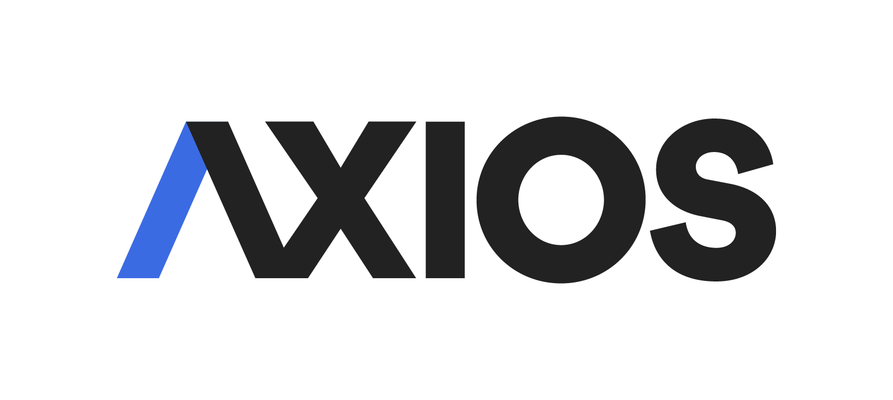

### 정적 타입: [Typescript](https://www.npmjs.com/package/typescript)

### Styling: [styled-components](https://www.npmjs.com/package/styled-components)

### Form 유효성 검증: [react-hook-form](https://www.npmjs.com/package/react-hook-form)

### 상태관리 라이브러리: [Redux](https://www.npmjs.com/package/redux)

### Grid: [@toast-ui/react-grid](https://www.npmjs.com/package/@toast-ui/react-grid)

### Redux 관련 라이브러리

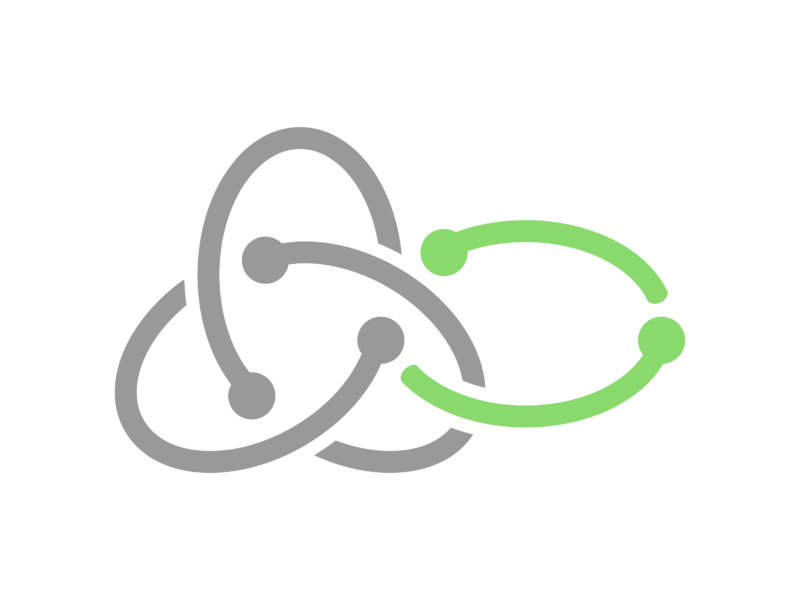

- [typesafe-actions](https://www.npmjs.com/search?q=typesafe-actions)
- [redux-persist](https://www.npmjs.com/package/redux-persist)
- [redux-saga](https://www.npmjs.com/package/redux-saga)
- [reselect](https://www.npmjs.com/package/reselect)
- [connected-react-router](https://www.npmjs.com/package/connected-react-router)

### Chart

- [recharts](https://www.npmjs.com/package/recharts)  

  

## 📌프로젝트 화면

### ▶1.결제  

#### 💬 1.1 결제 플랜
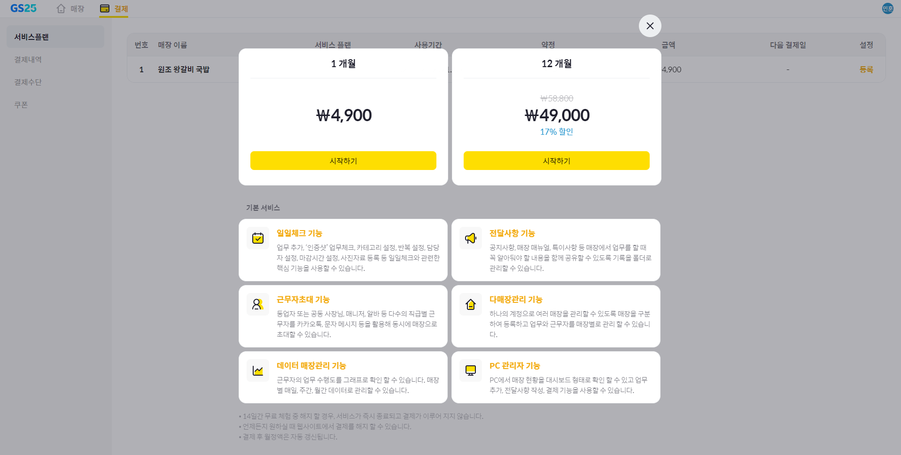  

#### 💬 1.2 결제 화면
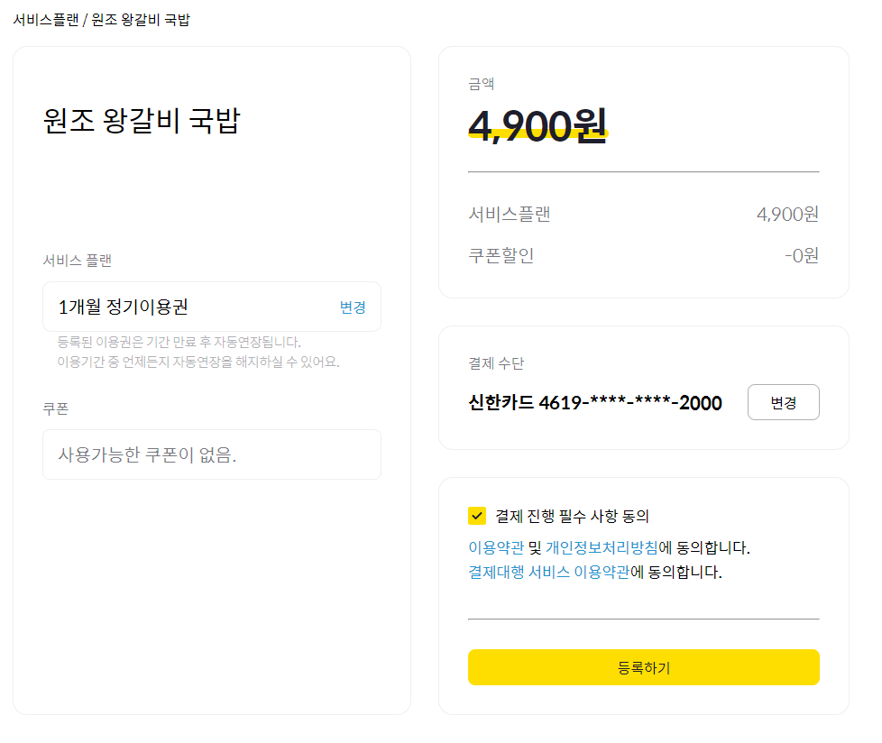  

#### 💬 1.3 결제 카드 등록
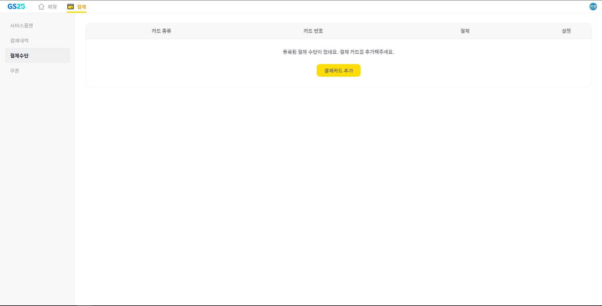  

#### 💬 1.4 페이플 카드등록 팝업
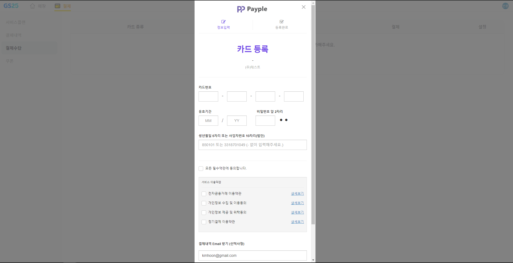  

#### 💬 1.5 결제 정보 상세 페이지
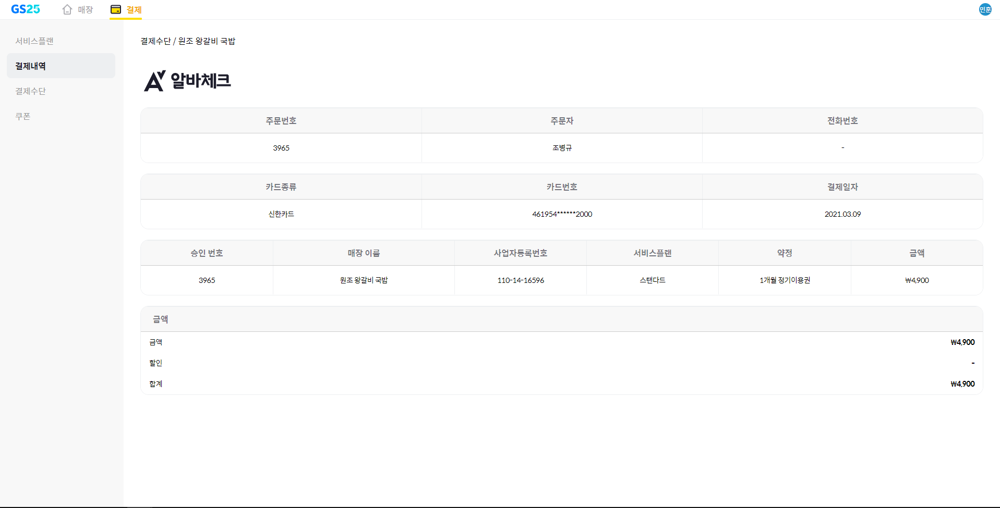  

#### 💬 1.6 결제 취소 팝업
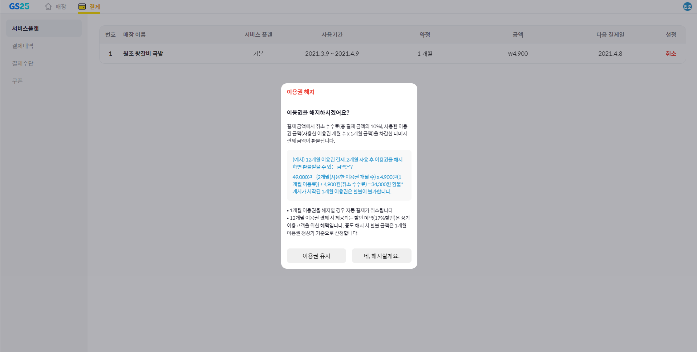  

---

### ▶ 2.모바일결제

#### 💬 2.1 모바일 로그인

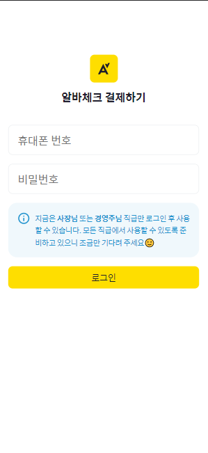  

#### 💬 2.2 결제 매장선택
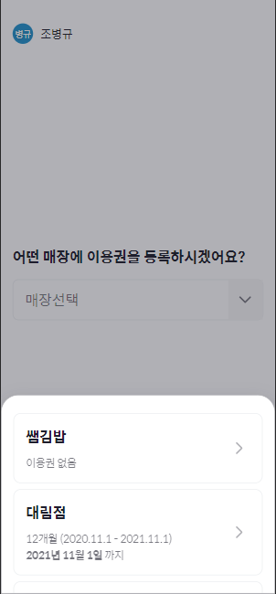  

#### 💬 2.3 결제 페이지
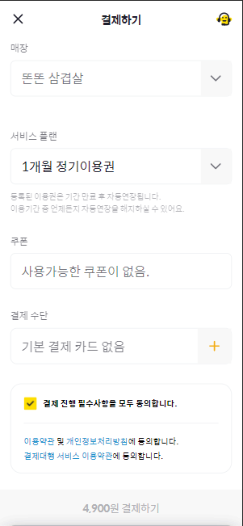  

#### 💬 2.4 결제 실패 케이스
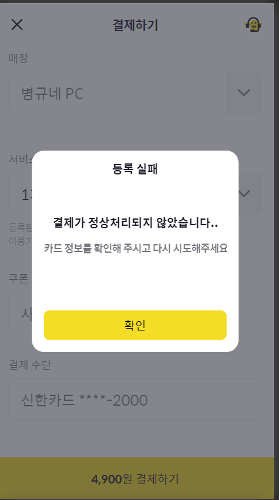  

---

### ▶3.통계 시각화

#### 💬 3.1 브랜드 주간 통계
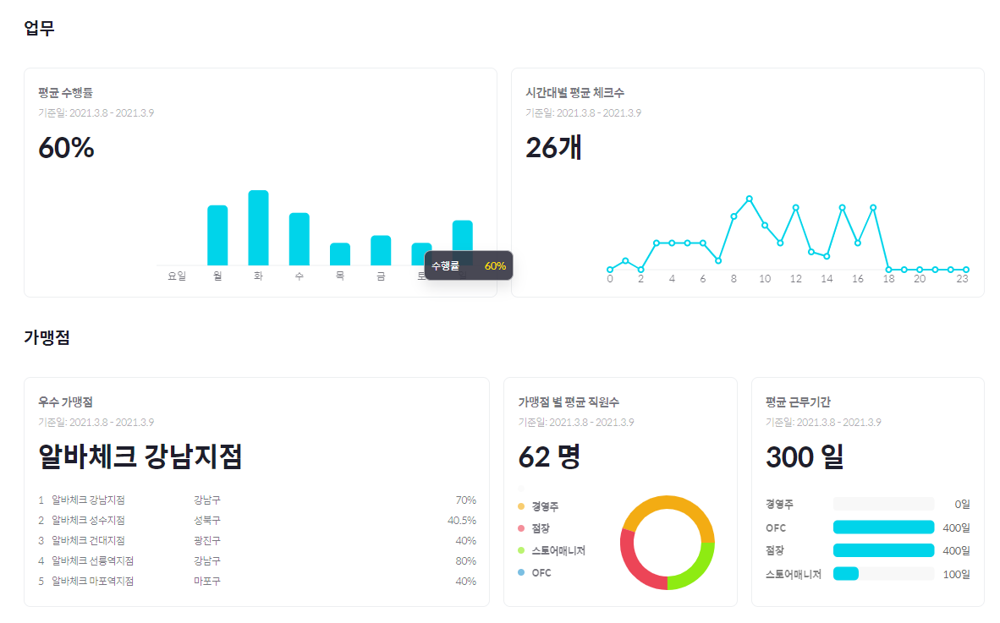  

#### 💬 3.2  가맹점 통계
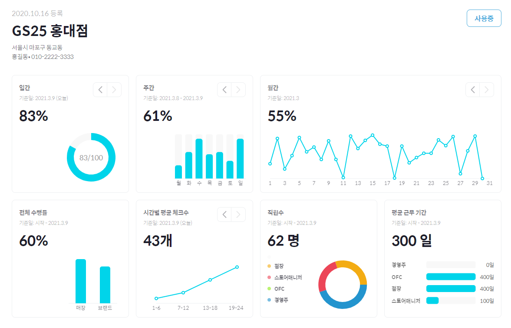  

####💬 3.3 브랜드 일간 통계
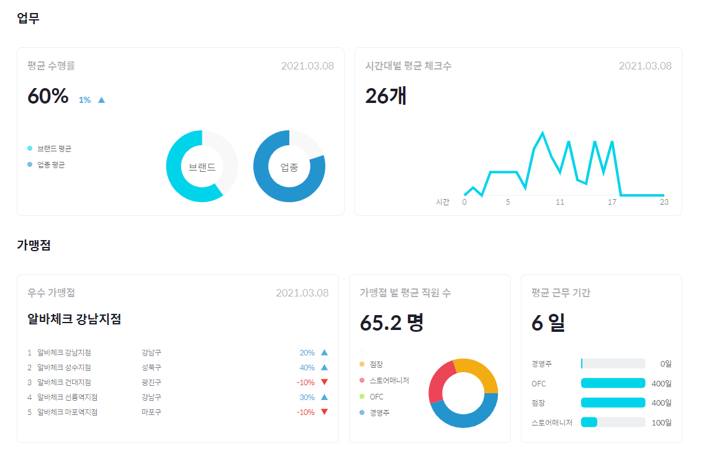  

---

### ▶4.업무등록

####  💬 4.1 업무 불러오기
  

#### 💬 4.2 업무 추가
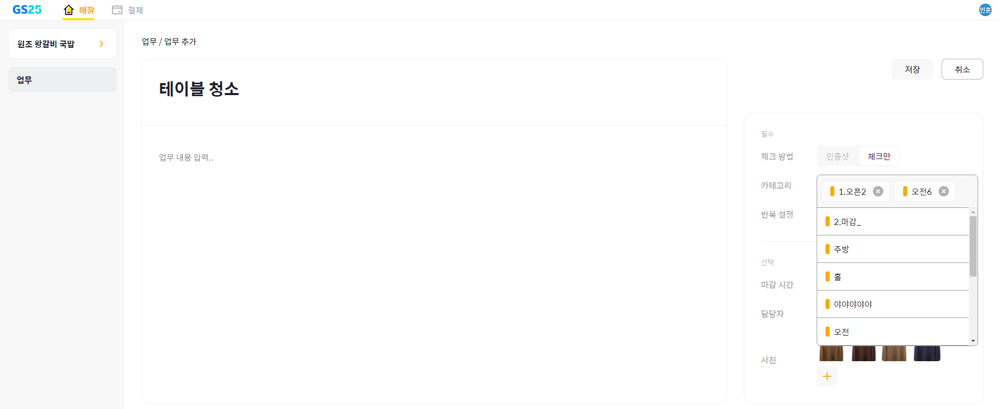  

#### 💬 4.3 업무 순서 변경
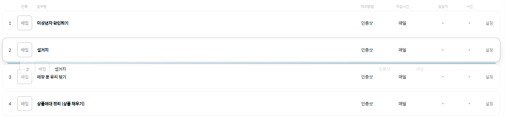  

#### 💬 4.4 뒤로가기 방지
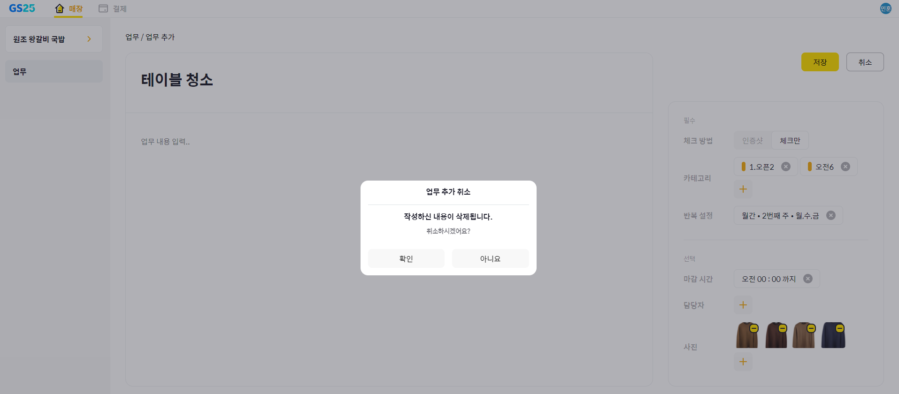  

---
