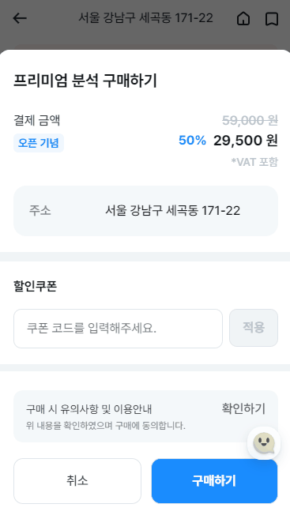
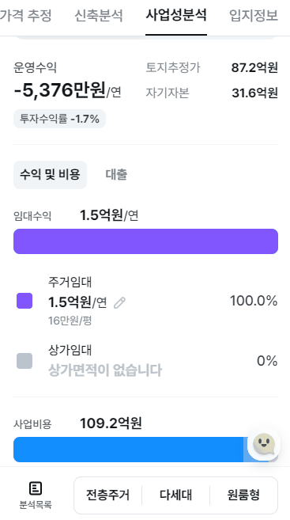
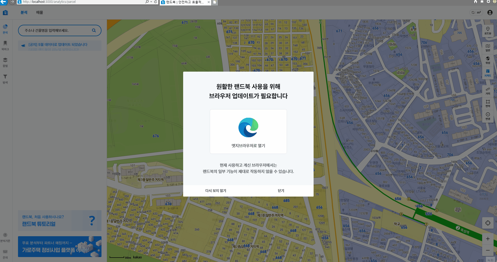

# 작업 내용

## Home Banner


- 자동 슬라이드
- 무한 슬라이드
- 스와이프 동작 지원

## 인앱결제


## 무료쿠폰 결제

- 이벤트를 위한 무료쿠폰을 이용한 결제요청



## [Component] TabBar



## [Component] Tab


```ts
<TabProvider value={value}>
  <TabList onChange={handleChange}>
    <Tab tabKey={TAB_ITEMS.BANANA} label="바나나" />
    <Tab tabKey={TAB_ITEMS.APPLE} label="사과" />
  </TabList>
  <TabPanel tabKey={TAB_ITEMS.BANANA}>바나나는 맛있어</TabPanel>
  <TabPanel tabKey={TAB_ITEMS.APPLE}>사과는 빨개</TabPanel>
</TabProvider>
```

## [Compnent] Button Tab

```ts
<Tabs theme="button" value={activeButtonId} onChange={handleChange}>
  {items.map((item) => (
    <Tab {...item} key={item.tabKey} />
  ))}
</Tabs>
```

## 조감도 평면도 랜더링 package 분리

## 통화 포멧팅 util 함수

```ts
toCurrency(1_234_456_789);
/**
{
    "shortValue": 12.3,
    "unit": "억",
    "unitValue": 100000000,
    "originValue": 1234456789,
    "realValue": 1230000000
}
*/
```

```ts
toCurrency(1_234_456_789).format();
// 12.3억원

toCurrency(1_234_456_789).format({ sperate: " " });
// 12.3 억원

toCurrency(1_234_456_789).format({ currencyUnit: false });
// 12.3억

toCurrency(199_234_456_789).format({ comma: true });
// 1,992.3억원
```

## 브라우저 전환 유도

- IE브라우저에서 크롬 브라우저로 유도하는 모달입니다.
- URL 스킴을 사용했습니다.


