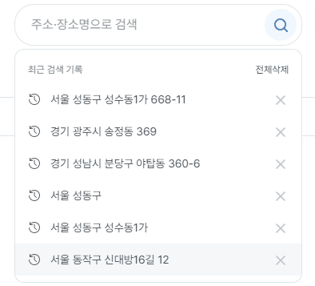
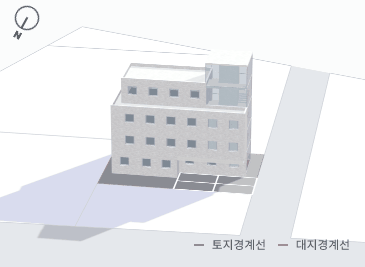
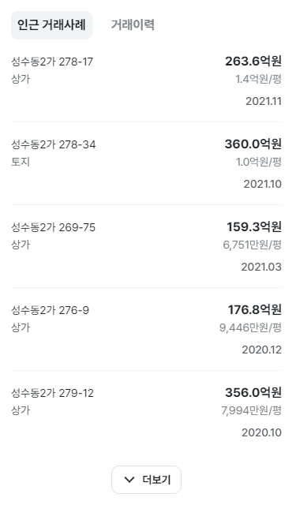
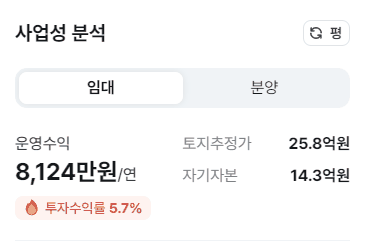

# 작업 내용

## Feature

### 1.주소검색



- kakao 주소검새 API연동
- 검색 자동완성 (debounce)
- 최근 검색 기록

### 2. 홈 배너


- 자동 슬라이드
- 무한 슬라이드
- 스와이프 동작 지원

### 3. 인앱결제


### 4. 무료쿠폰

- 이벤트를 위한 무료쿠폰을 이용한 결제요청


### 5. 조감도 평면도 랜더링 package 분리

- 하나의 repository에 결합되어 있던 조감도 렌더링 컴포넌트를 독립적인 package로 분리한 작업입니다.
- github packages regitsty를 이용해 내부 private package 배포



## Component

### TabBar


### Tab


```ts
<TabProvider value={value}>
  <TabList onChange={handleChange}>
    <Tab tabKey={TAB_ITEMS.BANANA} label="바나나" />
    <Tab tabKey={TAB_ITEMS.APPLE} label="사과" />
  </TabList>
  <TabPanel tabKey={TAB_ITEMS.BANANA}>바나나는 맛있어</TabPanel>
  <TabPanel tabKey={TAB_ITEMS.APPLE}>사과는 빨개</TabPanel>
</TabProvider>
```

### Button Tab

```ts
<Tabs theme="button" value={activeButtonId} onChange={handleChange}>
  {items.map((item) => (
    <Tab {...item} key={item.tabKey} />
  ))}
</Tabs>
```



### ToggleTab



### BottomSheet

- 모바일 바텀시트
- swipe로 열고 닫는 동작과 컨텐츠 스크롤링을 지원합니다.


### 통화 포멧팅 util 함수

- 통화 포멧팅 로직이 각 컴포넌트에 분산되어 있어 모든 기획 요구사항을 충족시키는 fotmat 함수가 필요한 상황이었습니다.

```ts
toCurrency(1_234_456_789);
/**
{
    "shortValue": 12.3,
    "unit": "억",
    "unitValue": 100000000,
    "originValue": 1234456789,
    "realValue": 1230000000
}
*/
```

```ts
toCurrency(1_234_456_789).format();
// 12.3억원

toCurrency(1_234_456_789).format({ sperate: " " });
// 12.3 억원

toCurrency(1_234_456_789).format({ currencyUnit: false });
// 12.3억

toCurrency(199_234_456_789).format({ comma: true });
// 1,992.3억원
```

### 브라우저 전환 유도

- 리뉴얼을 하며 IE를 브라우저 지원범위에서 제외됐고 IE로 접속한 사용자를 엣지 브라우저로 유도하는 모달입니다.
- IE브라우저에서 엣지 브라우저로 유도하는 모달입니다.
- URL 스킴을 사용했습니다.


