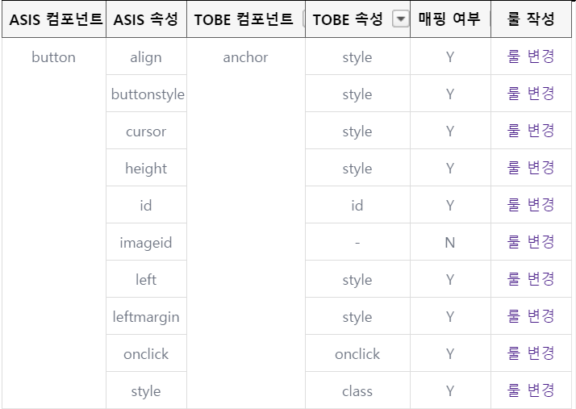
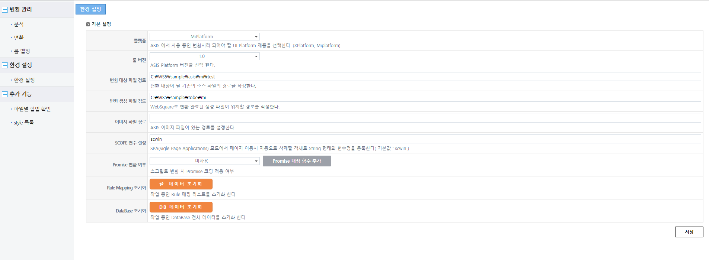
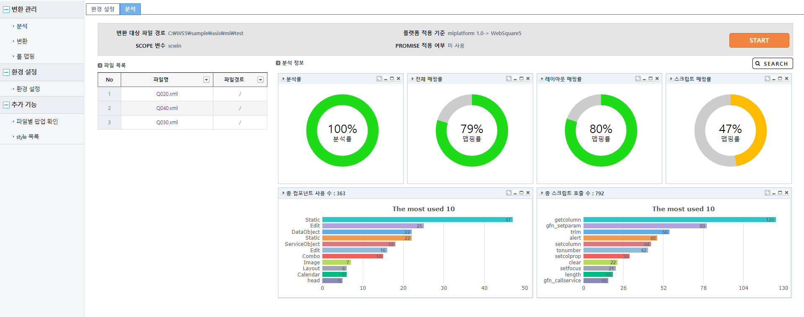
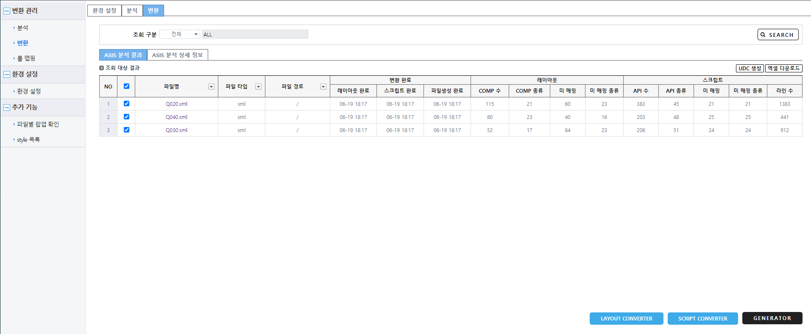
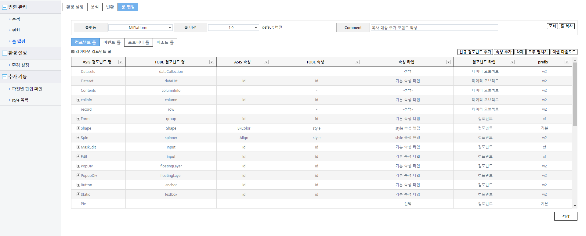
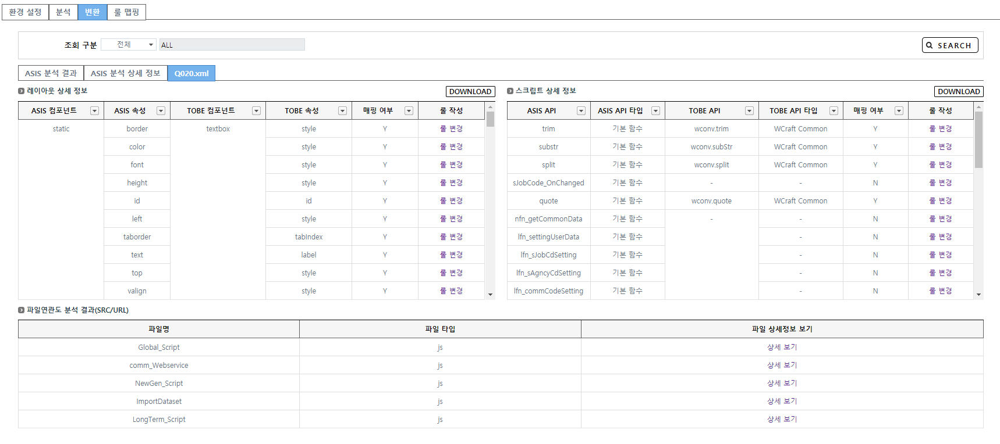

# W-craft


## TL;DR
1. [acorn](https://www.npmjs.com/package/acorn)패키지 Script AST 분석
2. [xmldom](https://www.npmjs.com/package/xmldom)패키지를 이용한 구문분석
3. chart.js를 이용한 데이터 시각화.


## intro
UI flatform 마이그레이션 툴.


## 작업내용.
- softbase사의 Xframe 변환 로직 작성.
- 솔루션 안정화

인스웨이브 시스템즈는 웹스퀘어라는 UI 솔루션을 납품하는 솔루션기업입니다.  
w-craft는 타사의 UI플랫폼을 웹스퀘어로 전환하는 마이그레이션 솔루션입니다.  

타사의 Flatform을 웹스쿼어로 전환하기 위해서 
각 컴포넌트의 구조를 분석해서 매핑룰을 작성해야합니다.  
Btton 컴포넌트를 분석을 예로 들어보겠습니다.  

*투비소프트 mifratfrom*
```xml
<Button 
    Id="btn_baddrow1"  
    Cursor="HAND" 
    Width="22" 
    Height="20" 
    Left="25" 
    Top="340" 
    OnClick="tab_unit_tabcx_btn_baddrow1_OnClick" 
    TabOrder="4"  
    Text="BTN_Addrow0" 
    Transparent="TRUE" 
    >
</Button>
```

*인스웨이브 Websquare*
```xml
<w2:anchor 
    id="btn_baddrow1" 
    style="cursor:hand; height:20px; position:absolute; left:26px; top:340px; width:22px;"  
    tabIndex="4"  
    ev:onclick="scwin.tab_unit_tabcx_btn_baddrow1_OnClick">
    <xf:label><![CDATA[BTN_Addrow0]]></xf:label>
</w2:anchor>
```
Button 컴포넌트의 각 속성을 websqare의 anchor 컴포넌트에 대응하는 속성으로 등록을 해야합니다.  
  
이런 식으로 변환 대상 플랫폼과 websquare의 컴포넌트를 비교해서 어떻게 변환할 것인지 분석한뒤 전환룰을 등록합니다.  
각 속성에 따라 1:1, n:1대응을 하기 때문에 각 속성의 전환 방식을 함수로 매핑해야합니다.  

```json
{
    "src_platform": "miplatform",
    "tar_platform": "websquare",
    "src_type": "Button",
    "tar_type": "anchor",
    "tar_type_cd": "component:anchor",
    "common_func": "basic.prefix_w2",
    "project_func": "",
    "attr": {
        "id": {
            "id": "basic.basicAttr"
        },
        "Align": {
            "style": "basic.styleAttr"
        },
        "VAlign": {
            "style": "basic.styleAttr"
        },
        "Appearance": {
            "style": "basic.styleAttr"
        }
        ...
    },
    "add_attr": {}
},
```
이런 식으로 각 컴포넌트의 태그 구조와 속성을 비교하여 전환 규칙을 작성해야합니다.  
컴포넌트 전환룰 내부의 각 속성변환룰을 등록해야합니다.  
가장 간단한 id속성을 예로 들겠습니다.  

```json
"id": {
        "id": "basic.basicAttr"
},
```
여기서`basic.basicAttr`은 속성을 어떻게 전환해 줄지 정의하는 함수입니다.  
```js
// basic.js
module.exports.basicAttr = function(tobeName){
	return tobeName;	
};
```
id의 경우 처럼 ASIS와 TOBE 속성명과 값이 같은 경우 같은 값을 반환하는 `basicAttr`을 등록하면 됩니다.  
각 속성의 전환 케이스는 `basic.js`파일에서 관리합니다.  


제가 작업한 새로운 마이그레이션 플랫폼(xFrame)을 추가하며내용은 
1. ASIS 플랫폼의 컴포넌트를 태그 구조 및 속성을 분석하여 매핑룰작성.
2. 1:1매핑이 안되는 경우 태그를 생성하는 로직 작성.
3. 불필요한 외부라이브러리르 걷어내서 라이브러리 의존성을 낮추는작업
    - lodash
    - blueBird


## 상세화면

### 환경설정

1. 타겟 플렛폼 설정
2. 타겟 폴더 설정
3. 룰 셋팅.


### 분석단계

1. 변환 파일 목록 생성.
2. 매핑률 분석

### 변환

1. 레이아웃 변환
2. 스크립트 변환
3. 변환 파일 병합.

### 룰 입력

1. 플랫폼별 룰 정보 추가 및 수정

### 룰 매핑 상태 확인.

- 미 매핑 룰 확인.


## 작업 후기
- 기존의 전환툴에서 PlatForm에 대한 전환룰을 작성하는것
- 기존 전환툴에 전환을 위한 Core 로직은 작성된 상황이라 큰 어려움은 없었음.
- xFrame의 Xml파일의 테그 구조를 분석하여 websqure문서로 만드는것이 가장 어려웠음.
    - i.g. Grid구조에서 헤더병합이나 Grid Body 병합같은 부분.