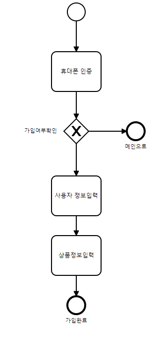
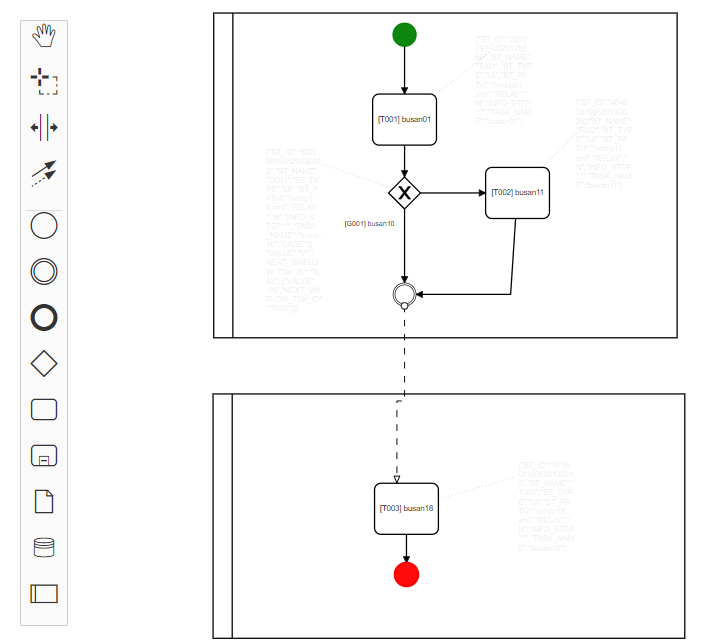
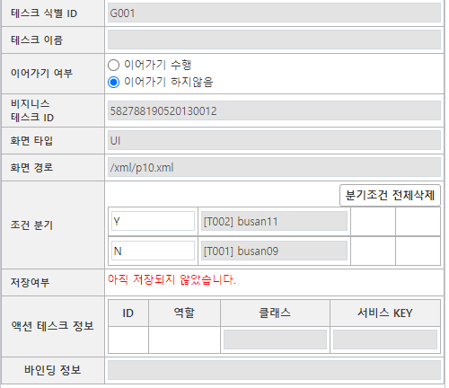

# Workflow


## TL;DR
- BPMN.io를 활용한 워크플로우 관리 프로젝트
- BPMN io: [데모](https://demo.bpmn.io/s/start)

## intro
- 화면 재활용 가능
- 상품 이어가기 가능.
- 프로세스 진척도 모니터링.


BPMN(Business Process Modeling Notation) 기반의 워크플로우 관리 솔루션입니다.  
주된 기능은 상품 가입 프로세스에서 프로세스의 각 단계(화면)를 다이어그램의 컴포넌트에 매핑하면 순서도의 흐름대로 화면이 흘러가게 할 수 있습니다.   
  

프로세스를 등록하는 이유는 각 화면의 **독립성**을 보장하기 위함입니다.  
각 화면은 다음 화면으로 어떤 화면으로 넘어갈지 알 수 없습니다.  
다이어그램을 에서 작성된 다음 화면으로 넘어갈 뿐입니다.  
해당 화면에서 다음 화면으로 넘어갈 때 `workflow.nextTask`함수를 호출합니다.  

이제 각 화면이 의존성이 없기때문에 다른 프로세스에서 재활용 가능합니다.
그게 이 workflow를 통해 얻을 수 있는 첫번째 이점입니다.  
또 `workflow.nextTask`를 호출할 때 각 화면의 정보를 저장하도록 서버에 요청하기 때문에 **프로세스 이어가기**가 가능합니다.  

workflow에서 프로세스를 제어하기 위한 몇가지 함수를 소개합니다.  
```js
// 특정 상품의 프로세스를 호출 및 시작합니다
workflow.startProcess("PG001");

// 다음화면으로 넘어갑니다.
workflow.nextTask();

// 현재 태스크 정보를 반환합니다.
workflow.getTask();

// 현재 프로세스가 종료되었음을 알립니다.
workflow.closeProcess();
```


**주요기능**  
1. 다이어그램 기반의 동적인 워크플로우 
    - 모바일 A상품 가입: [화면1, 화면2, 화면3, 화면4]
    - 테블릿 B상품 가입: [화면1, 화면3, 화면4]
2. 프로세스 이어가기
    - 모바일 A상품 가입: [화면1, 화면2, 화면3, 화면4] 에서 화면2까지 작업한뒤 상품가입에 재진입하면 화면3부터 이어가기를 진행합니다.  
3. 프로세스의 각 단계를 저장함으로써 사용자의 상품 가입 진척도 모니터링 가능.


### 직접 수행한 작업.
제가 작업한 주된 내용은 솔루션 안정화입니다.  
얽혀있는 소스코드를 정리하고 솔루션을 여러 플랫폼에서 범용적으로 사용할 수 있도록 기능의 추상화 과정을 했고 고객 요구사항에 따라 추가기능 개발 및 API개발을 했습니다.  
주된 수정작업으로는 고객사에서 사용중인 API의 입출력 포멧에 맞추어 기존 코드를 커스텀하는 작업을 했습니다.

직접 수행한 코드 안정화 사례를 소개합니다.  

#### 1. 함수가 단일책임을 하도록 코드분리

```js
//asis
var nextStep = function nextStep(){

		//1.데이터 검증 로직

		//2. 저장 포멧에 따른 데이터 가공로직

		//3. 저장 요청 로직
};
```
제가 작업하기 전 기존 코드는 이렇게 하나의 함수에 여러가지 작업이 복잡하게 얽혀있었습니다.  
이 함수를 각각의 한가지 역할을 수행하도록 나눴습니다.  
이로써 각각의 함수를 테스르할 수 있고 `nextStep`의 함수가 하는 수행 동작을 쉽게 파악할 수 있게 되었습니다.(가독성.)
```js
//tobe
var dataVertification = function(){}    //1.데이터 검증
var dataFormatter = function(){}        //2. 저장 포멧에 따른 데이터 가공
var insertStepInfo = function(){} 	    //3. 저장 요청 로직


var nextStep = function(data){
	
	try{
            data = dataVertification(data);
            data = dataFormatter(data);
			
            insertStepInfo(data)
	}catch(e){
            console.log(e)
	}

}
```

#### 2. 중복코드 제거
```js
//asis
if(param.result.targetInfo.state === "INIT"){

}else if(param.result.targetInfo.state === "PENDING"){

} else if(param.result.targetInfo.state === "DONE"){

}
```
이렇게 했을 경우 문제점은 `param.result.targetInfo.state`을 읽을 때 마다 
매번 객체 트리구조를 탐색을 해야합니다.  
이런 경우 하나의 변수를 선언하는 것이 낫습니다.  

```js
//tobe
var state = param.result.targetInfo.state;
if(state === "INIT"){

}else if(state === "PENDING"){

} else if(state === "DONE"){

}
```

#### 3. 함수 재활용성을 높히기 위한 환경 구성

기존의 코드는 하나의 메서드를 실행하면 4~5번의 서버 통신을 하는 함수가 많은데 
각 콜백에 다른 함수를 직접 호출함으로써 결합도가 높은 코드였습니다.

**문제**  
- 각 함수간 결합도로 인해 재활용이 어려움.
- 연속으로 4~5의 서버통신이 이뤄져서 디버깅 과정에서 호출흐름 파악이 어려움

```js
function startProcess(){

    var otp = {} //서버요청정보
    request(otp, function(res){
        task_1(res)
    })
}
```

고객요청사항을 수행하기 위해선 각 함수를 분리할 필요가 있었고 
함수 재활용을 하기 위해서 각 함수의 입력 포멧을 통일하고 `taskRuuner`를 만들어 제공했습니다.  
(ES3의 작업환경이었고 promise 폴리필을 사용할 수 없는 상황이었습니다)

```js
function task( param, callback){

	//비지니스 로직
	
	var result;

	if(typeof callback === 'function'){
		callback(result)
	}
}

```
모든 함수를 위와같은 포멧으로 수정한 뒤 아래와 같은 `task runner`를 만들어 제공했습니다.  

```js
var iterator = function iterator(array){

	var nextIndex = 0;
	
	return {
		"next" : function next(){
			return nextIndex<array.length 
					? {value: array[nextIndex++], done: false}
					: {done: true}
		
		},
		"hasNext" : function hasNext(){
			return (nextIndex < array.length)
		},
		"throwError": function throwError(e) {
			array = [];
			console.trace(e);
		}
	}
}


var taskRuuner = (function(){
	
	var ITERATOR = null;
	var STEP = 1;
	var PROCESS_NAME ="";
	
	return {
		clear: function clear(){
			STEP = 1;
			ITERATOR = null;
			PROCESS_NAME ="";
		},
		// 실행할 workList를 배열로 전달한다.
		pipeLine: function pipeLine(array,_processName){
			this.clear();
			
			ITERATOR = iterator(array);
			PROCESS_NAME = _processName;
			return this;
		},
		
		// work를 실행한다
		invoke : function invoke (param,callbackFn){
			var self = this;
			
			if(ITERATOR.hasNext()){
				var result	= ITERATOR.next();
				var work 	= result.value;
				var args		= [param, callbackFn]
				
				try{
					console.log("[taskRunner] "+PROCESS_NAME+"_Step"+STEP+" : "+work.name)
					STEP++;
					
					work.apply(WorkFlow, args)
					
				}catch(e){
					ITERATOR.throwError(e);
				}
				
			}else{
				console.log("taskRunner: All process is done")
			}
			
		},
		
		// 재귀호출을 하면서 비동기 호출을 연속으로 함
		run : function run(param){
			var self = this;
			
			self.invoke(param, function invokeCallback(args){
				self.run(args)
			})
		}
	}
	
})()
```


이제 `taskRunner`객체를 이용해서 배열로 비동기 함수 배열을 전달하고 
각 함수의 호출흐름을 추적할 수 있게 되었습니다.  
```js
// sample
var app = {};
app.start = function(param){

	//callback 패턴으로 작성된 함수목록 전달.
	var work = [
		setSessionData,
		initApplication,
		setSate	
	];

	taskRunner
	.pipeLine(work,"startApplication")
	.run(param);
}

/*
	[taskRunner] startApplication_step1 : setSessionData
	[taskRunner] startApplication_step2 : initApplication
	[taskRunner] startApplication_step3 : setSate
	[taskRunner] all Process is done;
*/

```

#### 4. 모듈패턴으로 private 멤버 관리 

기존 코드는 하나의 객체에 속성과 메서드를 노출시켜 
내부적으로 사용되는 속성과 메서드가 모두 노출되었습니다.  
```js
var app = {};

app.state = "INIT";
app.customerInfo  = {};
```

모듈 패턴을 적용해 코드를 밀실화 했습니다.  

```js
//tobe
var app = (function(){

	//private Data
	var STATE = "INIT";

	return {
		init: function(){
			STATE  = "INIT"
		},
		getState : function(){
			return STATE;
		}
	}
})()

```


## Skill
1. websquare
2. javascript
3. spring
4. Mysql


## 작업내용.
1. 제품 안정화
2. 코드 리펙토링
3. 요구사항에 따른 API 개발


## 상세화면

### 1.BPMN 프로세스(분기처리)
  


### 2.컴포넌트에 화면정보 입력.

- 화면경로 입력
- 분기 컴포넌트인 경우 케이스별 이동경로 입력.  




