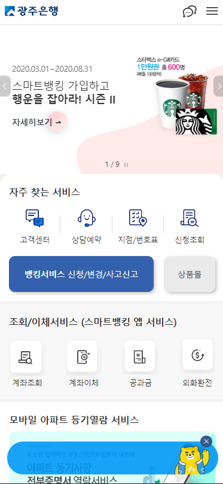
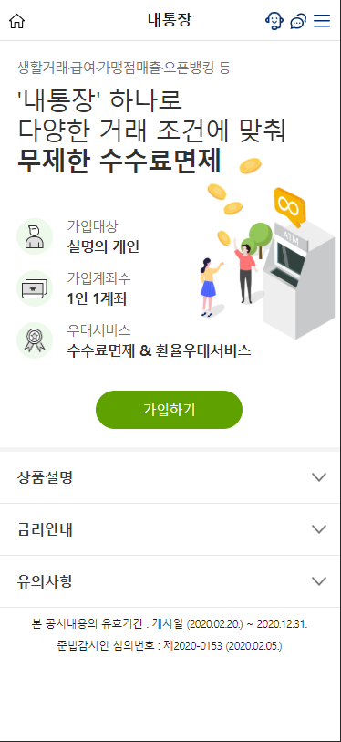
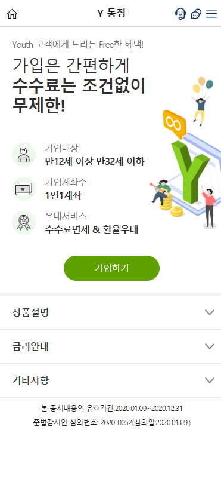
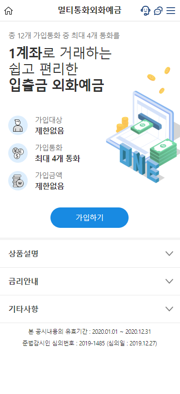
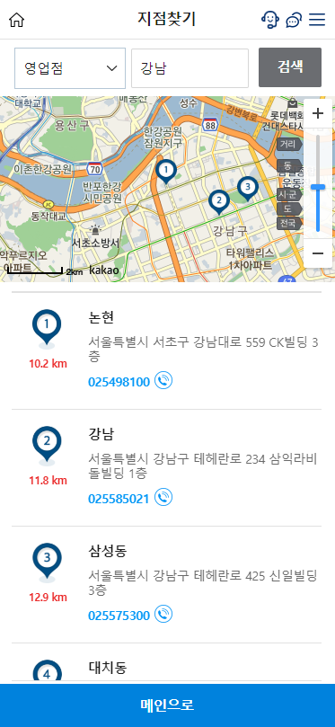
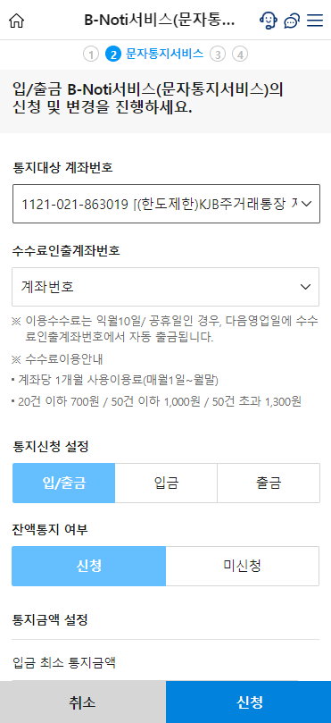
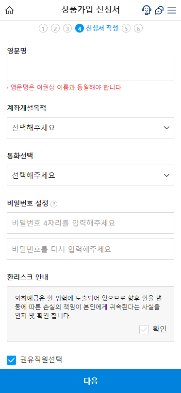
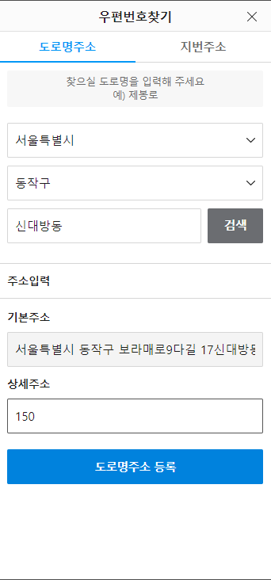
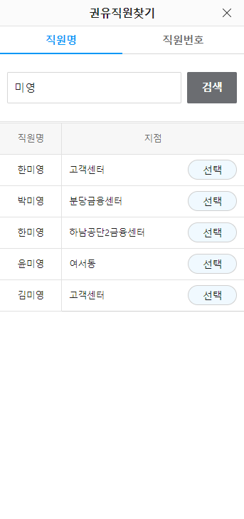
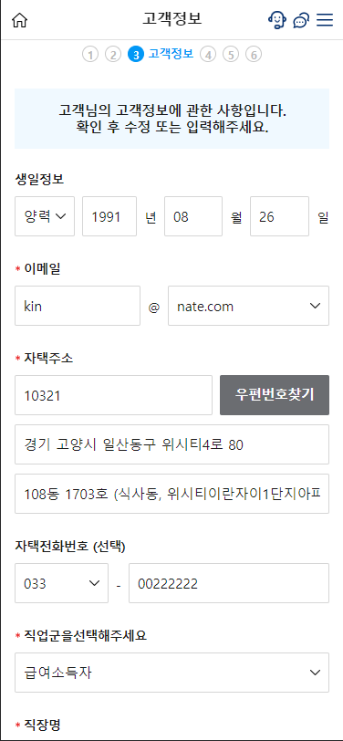

## 광주은행 모바일 웹 뱅킹

## TL;DR
- 멀티 디바이스, 멀티 브라우저를 지원하는 모바일 웹 프로젝트
- REST API를 이용한 모바일 웹 구축  
- Daum map API를 이용한 은행지점찾기.  

## 작업내용
은행사에서 제공하는 REST API를 이용해 모바일 웹을 제작하는 프로젝트로 제가 작업한 내용은 퍼블리싱을 제외한 프론트엔드 포지션입니다.  

상품별 스토리보드와 REST API를 제공받고 고객 요청사항과 설계서의 내용을 바탕으로 기능을 구현했습니다.

## 기술스펙
- Websquare( 자바스크립트 기반 상용 UI프레임워크)
- HTML5
- CSS3
- javascript
- Spring 

### 금융상품
1. 입출금 통장 개설
2. Y통장 개설
3. 멀티통화외화예금 개설

### 서비스
1. 지점찾기
    - 다음 Map API이용
2. 이체한도 변경
3. 장기 미사용 해제
4. 입출금 알림서비스 
5. 번호표뽑기

### 공통 화면
1. 사용자 정보 입력
2. 우편 번호 검색 팝업
3. 권유직원 검색 파업

## 금융상품

### 1.입출금통장

### 2. Y통장

### 3. 멀티통화외화예금

## 서비스 5종

### 1. 지점찾기.

- 다음 MAP API이용.

### 2. 문자통지 서비스

## 상세화면

### 1.상품 신청서 (멀티통화외화예금)

### 2. 주소찾기 팝업

### 3. 권유직원 찾기 팝업

### 4. 고객정보 입력

